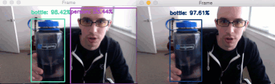
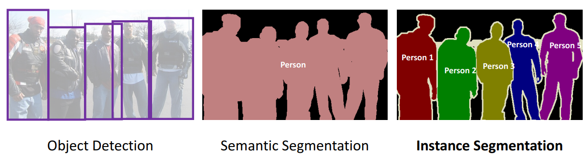

<h1 align="center"> 
 [ Article AI For Image Task ]
<h1>
 

 
### ภาพ (Image)
 - คือ **Array** ของตัวเลขในขนาด 2 มิติ ประกอบด้วย ความกว้าง (width), ความสูง (height) <br>หรือ 3 มิติ ประกอบด้วย ความกว้าง (width), ความสูง (height), ความลึก (depth)
 - ปกติเทรนโมเดลหลายๆ **libraries** จะจัดวางแบบ <br>(depth, height, width)
 
```java
 เช่น (3, 254, 224) => depth = 3, height = 254, width = 224
```
 
 - เวลาเทรนโมเดลด้วย **Pytorch** เราจะกำหนดให้ **batch size** อยู่ด้านหน้าสุดตามด้วยขนาดภาพ ดังนี้ <br>(batch size, depth, height, width) 
 
```java
 เช่น (32, 3, 224, 224) => batch size = 32,depth = 3, height = 224, width = 224
```
 
<br>
 
# APPLICATION OF DEEP LEARNING FOR IMAGE ANALYSIS
 
### Image Classification
 - การจำแนกรูปภาพ เป็นงานพื้นฐานที่พยายามทำความเข้าใจภาพรวมทั้งหมด
 - เป้าหมายเพื่อกำหนดป้ายหรือลาเบล (คือบอกให้ได้เป็นรูปอะไร)
 - โดยทั่วไป การจัดประเภทรูปภาพหมายถึง รูปภาพที่มีเพียงหนึ่ง **Object** เท่านั้นที่ปรากฏและถูกวิเคราะห์
 
ในทางตรงกันข้าม การตรวจจับวัตถุ **(object detection)** เกี่ยวข้องกับงานการจำแนกประเภท **(classification)** และการหาขอบของภาพ <br>และใช้ในการวิเคราะห์กรณีที่สมจริงมากขึ้นซึ่งอาจมีวัตถุหลายชิ้นอยู่ในรูปภาพ
 
 <p align="center">
  <br>
  
 <p>
 
### #Object Detection
 - เป็นเทคโนโลยีคอมพิวเตอร์ ที่เกี่ยวข้องกับการมองเห็นด้วยคอมพิวเตอร์และการประมวลผลภาพที่เกี่ยวข้องกับการตรวจจับ <br>อินสแตนซ์ของวัตถุเชิงความหมายบางประเภท (เช่นมนุษย์ อาคาร หรือรถยนต์) ในภาพและวิดีโอดิจิทัล
### #Semantic Segmentation
 - เป็นการประมวลผลภาพที่เกี่ยวข้องกับการตรวจจับ ที่อยู่ใกล้กันเป็น **Object** เดียวกัน
### #Instance Segmentation
 - ทำงานคล้ายกับ **Semantic Segmentation** แต่สามารถระบุ **ID** ของ **Object** ในภาพด้วย
  
<p align="center">
 
<p><br>
   
<h1 align="center">Real-Time Object Detection?</h1>
<p align="center">
 <br>
 
<p><br>

#


# Note

Full Content File PDF : [AI for Image Task](File/PDF/AI%20for%20image%20task.pdf)
